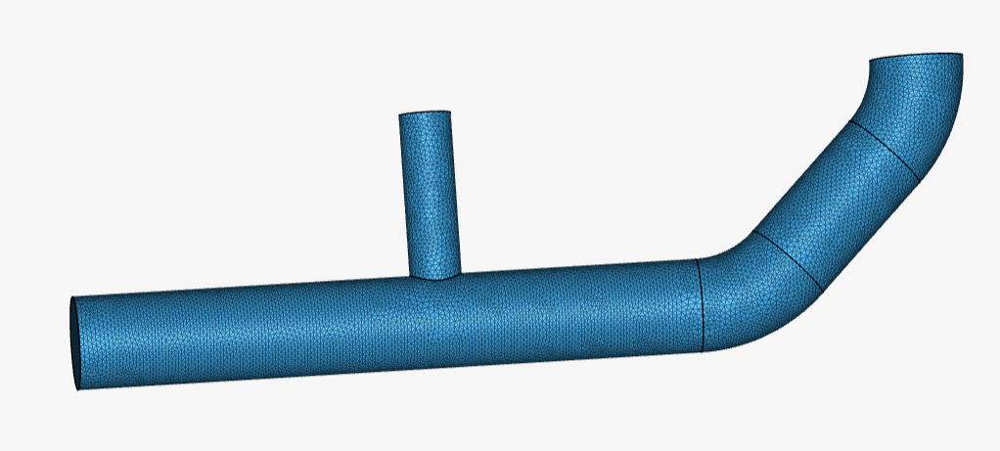
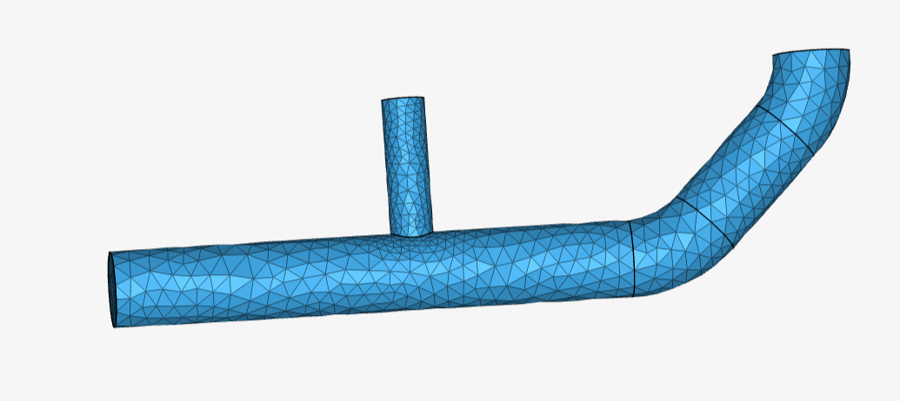
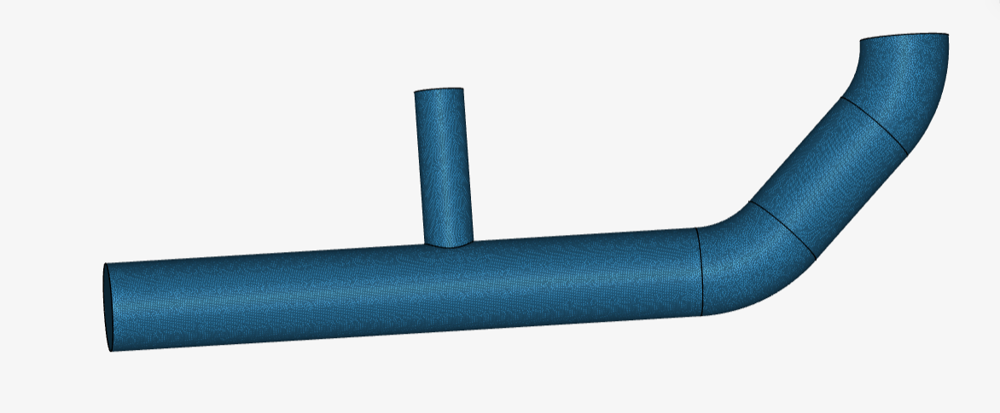
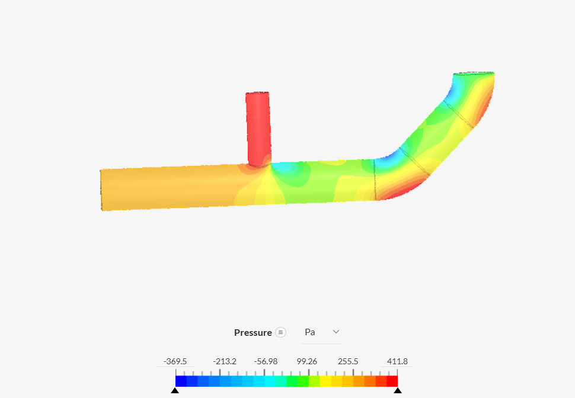
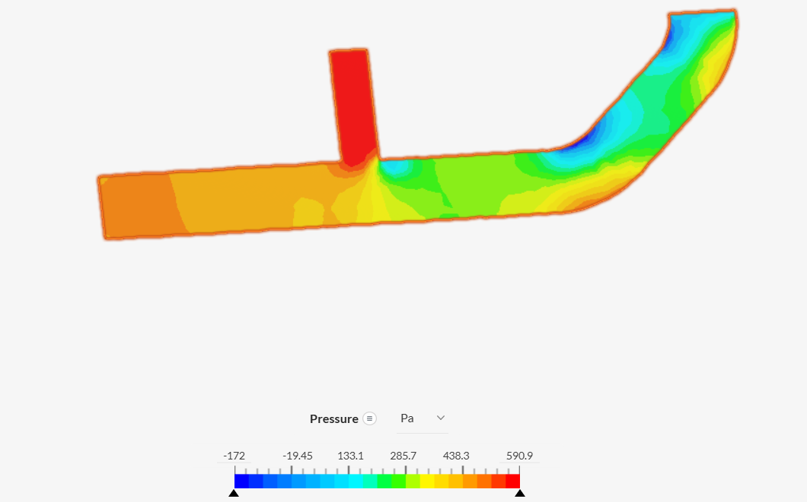
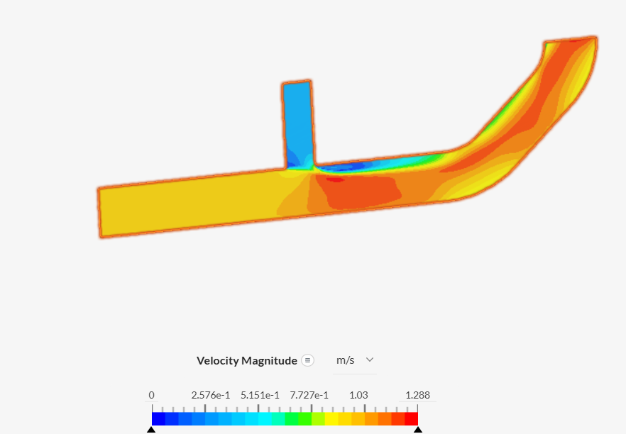
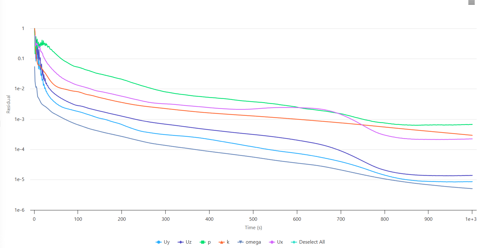
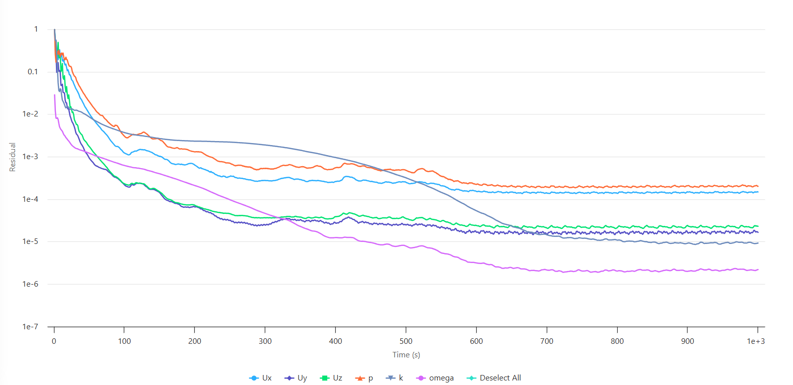
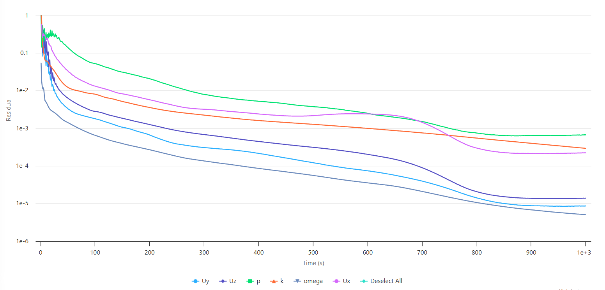

# CFD Analysis of Pressure Drop and Flow Distribution in a Pipe Junction Using SimScale

## 1. Project Overview

This project presents a Computational Fluid Dynamics (CFD) study of incompressible water flow through a pipe junction using SimScale.

The geometry consists of a large-diameter main pipe connected to a smaller branch inlet, followed by a curved downstream section. The original geometry was used as the starting point for the study, after which an internal flow volume was created to define the computational fluid domain.

A steady-state incompressible CFD analysis was performed using the k–ω SST turbulence model and water as the working fluid.

Three computational meshes with different fineness settings were generated and simulated under the same physical and boundary conditions. The resulting pressure fields and solver residuals were compared to investigate the influence of mesh resolution on the numerical solution.

The project demonstrates a practical CFD workflow involving geometry preparation, internal flow-volume extraction, material assignment, boundary-condition specification, mesh generation, solver execution, residual analysis, and post-processing.

---

## 2. Project Objectives

The main objectives of this study were to:

- Investigate incompressible flow through a pipe junction.
- Analyze pressure distribution throughout the pipe geometry.
- Examine pressure variations near the branch junction and downstream bend.
- Investigate flow distribution within the pipe system.
- Study the influence of mesh resolution on the CFD solution.
- Compare solver residual behavior for different mesh resolutions.
- Visualize pressure fields obtained from the three mesh cases.
- Assess the numerical behavior of the simulations.
- Develop practical CFD experience relevant to process piping systems.

---

## 3. Simulation Setup

| Parameter | Specification |
|---|---|
| **CFD Platform** | SimScale |
| **Analysis Type** | Incompressible Flow |
| **Analysis Approach** | Steady-state |
| **Turbulence Model** | k–ω SST |
| **Working Fluid** | Water |
| **Computational Domain** | Internal flow volume |
| **Large-Diameter Inlet Velocity** | 1.0 m/s |
| **Small-Diameter Inlet Velocity** | 0.2 m/s |
| **Outlet Condition** | Pressure outlet |
| **Simulation End Time** | 1,000 s |
| **Number of Mesh Cases** | 3 |

All three mesh cases were simulated using the same general physical model and boundary conditions to allow comparison of the effect of mesh resolution.

---

## 4. Geometry Preparation

The pipe-junction geometry was used as the starting point for the CFD study.

The geometry contains:

- A large-diameter main pipe.
- A smaller-diameter branch inlet.
- A junction between the two flow passages.
- A downstream curved pipe section.

An internal flow volume was subsequently created to represent the fluid region inside the pipe system.

### Geometry Workflow

1. Import the pipe-junction geometry into SimScale.
2. Prepare the geometry for internal-flow analysis.
3. Create the internal flow volume.
4. Define the resulting fluid region as the computational domain.
5. Assign the required boundary faces.
6. Generate computational meshes with different fineness settings.
7. Run the CFD simulations for each mesh.

Creating an internal flow volume allows the CFD solver to calculate the flow field within the actual fluid passage rather than solving the external geometry.

---

## 5. Material

| Region | Material |
|---|---|
| **Internal flow region** | Water |

Water was selected as the working fluid for the incompressible flow simulations.

The material properties used by the solver are determined by the water material definition selected in SimScale.

---

## 6. Boundary Conditions

The two inlet streams were defined using velocity boundary conditions, while a pressure outlet was specified at the downstream exit.

| Boundary | Condition |
|---|---|
| **Large-Diameter Inlet** | Velocity inlet |
| **Large-Diameter Inlet Velocity** | 1.0 m/s |
| **Small-Diameter Inlet** | Velocity inlet |
| **Small-Diameter Inlet Velocity** | 0.2 m/s |
| **Outlet** | Pressure outlet |
| **Working Fluid** | Water |

The large-diameter inlet introduces water at a velocity of:

\[
U_1 = 1.0\;m/s
\]

The smaller branch inlet introduces water at:

\[
U_2 = 0.2\;m/s
\]

The two streams interact at the junction before continuing through the downstream pipe and curved outlet section.

The pressure-outlet condition provides the downstream pressure reference for the flow solution.

---

## 7. Mesh Generation

Three meshes were generated using different SimScale fineness settings.

| Mesh | Fineness | Relative Resolution |
|---|---:|---|
| **Mesh 1** | 5 | Intermediate |
| **Mesh 2** | 2 | Coarse |
| **Mesh 3** | 8 | Fine |

The three meshes were simulated using the same physical model and boundary conditions.

### 7.1 Mesh 1 — Fineness 5

Mesh 1 was generated using a fineness setting of 5 and represents an intermediate mesh resolution.

---

### 7.2 Mesh 2 — Fineness 2

Mesh 2 was generated using a fineness setting of 2 and represents the coarsest of the three mesh cases.

---

### 7.3 Mesh 3 — Fineness 8

Mesh 3 was generated using a fineness setting of 8 and represents the finest mesh among the three cases.

The finer mesh provides greater spatial resolution for pressure and velocity gradients, particularly around the branch junction and downstream bend.

---

## 8. Mesh-Variation Study

The three mesh resolutions were investigated to determine how mesh refinement affects the computed solution.

The cases can be classified as:

- **Mesh 2:** Coarse
- **Mesh 1:** Intermediate
- **Mesh 3:** Fine

The same physical model, material, boundary conditions, turbulence model, and simulation end time were used for all three cases.

This allows differences in the resulting pressure fields and residual histories to be associated primarily with changes in mesh resolution.

---

# 9. Results and Post-Processing

## 9.1 Pressure Distribution — Mesh 1

The pressure contour for Mesh 1 shows significant spatial variation throughout the pipe-junction geometry.

Pressure changes are particularly visible around:

- The branch junction.
- The region immediately downstream of the junction.
- The downstream curved section.

The displayed pressure range is approximately:

\[
-369.5\;Pa \leq p \leq 411.8\;Pa
\]

The pressure gradients indicate local changes in the flow field associated with stream interaction, geometric changes, and changes in flow direction.

---

## 9.2 Pressure Distribution — Mesh 2

The Mesh 2 pressure field shows a similar overall spatial pattern to Mesh 1.

The displayed pressure range is approximately:

\[
-172\;Pa \leq p \leq 590.9\;Pa
\]

The pressure variation is again concentrated around the branch junction and downstream curved section.

Although the qualitative pressure-field structure is similar, the displayed pressure extrema differ from Mesh 1. This indicates that the calculated local pressure field is sensitive to mesh resolution.

---

## 9.3 Pressure Distribution — Mesh 3

The Mesh 3 pressure contour was obtained using the finest mesh, with a fineness setting of 8.

The displayed pressure range is approximately:

\[
-369.5\;Pa \leq p \leq 411.8\;Pa
\]

The pressure distribution shows pronounced gradients near the branch junction and downstream curved section.

The overall pressure-field pattern is similar to the other mesh cases, while the finer mesh provides increased spatial resolution of the flow region.

---

# 10. Solver Residual Analysis

## 10.1 Mesh 1 Residuals

The Mesh 1 residual history shows a substantial reduction in the residuals during the simulation.

Several variables decrease into approximately the \(10^{-5}\) to \(10^{-4}\) range toward the end of the simulation, while the pressure residual remains comparatively higher.

The residuals generally stabilize during the later portion of the simulation.

---

## 10.2 Mesh 2 Residuals

The Mesh 2 residual history also shows a substantial initial decrease.

Several residuals reach approximately the \(10^{-5}\) range, while the pressure and some velocity residuals remain higher.

Some oscillatory behavior is visible during the later stages of the simulation, indicating that the solution variables do not all reach a perfectly flat residual history.

---

## 10.3 Mesh 3 Residuals

The Mesh 3 residual history shows an overall decreasing trend throughout the simulation.

Several residuals reach approximately the \(10^{-5}\) to \(10^{-4}\) range, while the pressure residual remains comparatively higher.

The finer mesh therefore does not necessarily produce the lowest residual value for every variable. Mesh refinement changes the numerical system and can alter residual behavior.

---

# 11. Mesh-Variation Results

The three simulations provide useful qualitative information about the influence of mesh resolution.

### Pressure-Field Comparison

The pressure contours from all three mesh cases show broadly similar flow behavior:

- Pressure varies significantly around the branch junction.
- The flow redistributes downstream of the junction.
- Additional pressure variation occurs around the curved outlet section.
- The overall spatial pattern of the pressure field remains recognizable across the three mesh resolutions.

However, the displayed pressure ranges differ:

| Mesh | Fineness | Displayed Pressure Range |
|---|---:|---:|
| **Mesh 2** | 2 | −172 to 590.9 Pa |
| **Mesh 1** | 5 | −369.5 to 411.8 Pa |
| **Mesh 3** | 8 | −369.5 to 411.8 Pa |

An important observation is that **Mesh 1 and Mesh 3 show the same displayed pressure range**, whereas Mesh 2 produces a different range.

This suggests that increasing the mesh resolution from fineness 5 to fineness 8 does not produce an obvious change in the displayed pressure extrema.

However, this observation alone is **not sufficient to claim mesh independence**.

---

# 12. Pressure-Drop Analysis

Pressure drop is an important engineering parameter for evaluating flow resistance in piping systems.

For defined inlet and outlet locations, pressure drop is calculated as:

\[
\Delta P = P_{in} - P_{out}
\]

The pressure contours demonstrate substantial pressure variation throughout the pipe junction and downstream bend.

However, the minimum and maximum values shown on a contour cannot directly be used as the system pressure drop because those values may occur at different locations within the computational domain.

Therefore, the correct pressure-drop calculation requires extracting pressure at **consistent inlet and outlet cross-sections** for each mesh.

At the current stage, the contour results are used to provide qualitative information about pressure variation rather than a final quantitative pressure-drop value.

---

# 13. Engineering Interpretation

The pipe junction involves interaction between two water streams with different inlet velocities.

The large-diameter inlet has:

\[
U_1 = 1.0\;m/s
\]

while the smaller branch inlet has:

\[
U_2 = 0.2\;m/s
\]

The interaction of these streams creates a non-uniform pressure field around the junction.

The downstream bend introduces another change in flow direction, producing additional pressure and velocity variations.

These effects are important in process piping systems because junctions, branches, and bends contribute to flow redistribution and pressure losses.

The results therefore provide practical insight into how geometric features influence internal pipe flow.

---

# 14. Convergence Assessment

The residual histories for all three mesh cases show substantial reduction from their initial values.

However, residuals alone should not be used as the only criterion for declaring convergence.

A more complete convergence assessment should also consider:

- Stability of monitored pressure values.
- Stability of outlet flow quantities.
- Mass conservation.
- Stability of the pressure drop.
- Changes in key engineering quantities during the final part of the simulation.

The present results therefore demonstrate **numerical residual reduction**, but further engineering-quantity monitoring would strengthen the convergence assessment.

---

# 15. Limitations and Future Work

The current study provides a useful comparison of three mesh resolutions, but several additional analyses could strengthen the engineering conclusions.

### 1. Quantitative Pressure-Drop Calculation

Extract pressure at identical inlet and outlet cross-sections for all three meshes and calculate:

\[
\Delta P = P_{in} - P_{out}
\]

This would provide a direct quantitative comparison of the mesh results.

### 2. Formal Mesh-Independence Study

Compare pressure drop and other relevant engineering quantities across the three meshes.

The percentage difference between successive mesh resolutions can then be calculated to determine whether further mesh refinement produces negligible changes.

### 3. Mass-Conservation Check

Verify that the mass flow entering through the two inlet boundaries is consistent with the mass flow leaving through the outlet.

### 4. Mesh-Quality Assessment

Record cell count and relevant mesh-quality metrics for each mesh.

### 5. Flow-Structure Analysis

Use velocity contours and streamlines to investigate:

- Flow acceleration
- Flow deceleration
- Recirculation
- Mixing
- Flow separation
- Secondary flow near the bend

### 6. Convergence Monitoring

Monitor pressure drop, outlet flow rate, and other engineering quantities in addition to solver residuals.

---

# 16. Conclusion

This project presents a steady-state CFD analysis of incompressible water flow through a pipe junction using SimScale.

The study involved:

- Geometry preparation.
- Internal flow-volume creation.
- Water material assignment.
- k–ω SST turbulence modeling.
- Velocity inlet boundary conditions.
- Pressure-outlet specification.
- Generation of three mesh resolutions.
- Pressure-field visualization.
- Solver residual analysis.
- Mesh-variation investigation.

The three mesh cases produced broadly similar qualitative pressure-field patterns, with the most significant pressure variations occurring around the branch junction and downstream curved section.

Mesh 1 and Mesh 3 produced the same displayed pressure range, while Mesh 2 showed a different range. This suggests that the solution becomes more consistent between the intermediate and fine mesh cases, although the available contour results alone are not sufficient to establish formal mesh independence.

The residual histories for all three cases show substantial numerical reduction, but additional monitoring of engineering quantities would provide a stronger convergence assessment.

A quantitative pressure-drop comparison using identical inlet and outlet locations is the recommended next step for establishing the sensitivity of the solution to mesh refinement.

Overall, the project demonstrates a practical CFD workflow for investigating flow distribution and pressure variation in process piping geometry.

---

# 17. Skills Demonstrated

- Computational Fluid Dynamics (CFD)
- SimScale
- Internal flow analysis
- Pipe-junction flow analysis
- k–ω SST turbulence modeling
- Geometry preparation
- Internal flow-volume extraction
- Boundary-condition specification
- Computational mesh generation
- Mesh-variation analysis
- Pressure-field visualization
- Solver residual interpretation
- Numerical convergence assessment
- Pressure-drop analysis
- Engineering interpretation of CFD results
- Process-piping flow analysis

---

# 18. Simulation Project

**SimScale Project:**  
[View the CFD simulation on SimScale](https://www.simscale.com/workbench/?pid=2161124160470678585&location=simulation:c17e0c7a-107e-4071-b31f-f43f6c57093c)

---

## 19. Acknowledgment

The starting pipe-junction geometry was obtained from an existing source and used as the basis for this CFD study.

The geometry source is acknowledged to distinguish the original geometry from the simulation setup, mesh comparison, post-processing, and engineering interpretation performed in this study.
